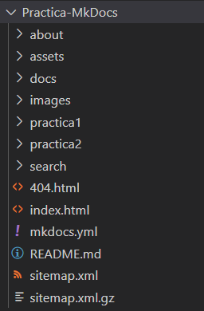
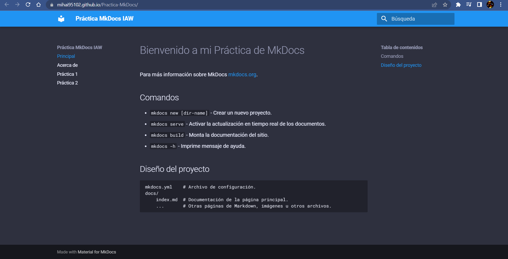

# Practica-MkDocs
Práctica MkDocs

## Estructura
La estructura de directorios que usaremos será la siguiente:



## Creción de nuestro Blog:
Para crear nuestro blog ejecutaremos el siguienete comando para que se cree la estructura de Jekyll:
```bash
docker run -it --rm -v "$PWD:/srv/jekyll" jekyll/jekyll jekyll new blog
```

## Creación de los Posts:
Crearemos los posts en lenguaje Markdown dentro de la carpeta de "posts" y guardaremos el archivo de la siguiente forma: _2023-02-20-practica1.markdown_

## Generamos el código HTML
Creados los posts con Markdown, ahora tendremos que generar el código HTML de los posts con el siguiente comando:
```bash
docker run -it --rm -v "$PWD:/srv/jekyll" jekyll/jekyll jekyll build
```
Cuando ejecutemos este comando se nos creará la carpeta de "site".

## Configuración:
Para configurar la página de Jekyll, aplicando temas, título, descriptción, contactos, etc. Para ello editaremos el archivo de "_config.yml_".

El archivo quedaría de la siguiente forma:
```yaml
# Welcome to Jekyll!
#
# This config file is meant for settings that affect your whole blog, values
# which you are expected to set up once and rarely edit after that. If you find
# yourself editing this file very often, consider using Jekyll's data files
# feature for the data you need to update frequently.
#
# For technical reasons, this file is *NOT* reloaded automatically when you use
# 'bundle exec jekyll serve'. If you change this file, please restart the server process.
#
# If you need help with YAML syntax, here are some quick references for you: 
# https://learn-the-web.algonquindesign.ca/topics/markdown-yaml-cheat-sheet/#yaml
# https://learnxinyminutes.com/docs/yaml/
#
# Site settings
# These are used to personalize your new site. If you look in the HTML files,
# you will see them accessed via {{ site.title }}, {{ site.email }}, and so on.
# You can create any custom variable you would like, and they will be accessible
# in the templates via {{ site.myvariable }}.

title: Práctica Jekyll IAW
email: mbut182@g.educaand.es
description: >- # this means to ignore newlines until "baseurl:"
  Hola buenas tardes esto es una prueba de creación de un página Web con Jekyll.
baseurl: "Practica-Jekyll" # the subpath of your site, e.g. /blog
url: "https://mihai95102.github.io/Practica-Jekyll/" # the base hostname & protocol for your site, e.g. http://example.com
twitter_username: ElMatador95102
github_username:  Mihai95102

# Build settings
theme: minima
plugins:
  - jekyll-feed

# Exclude from processing.
# The following items will not be processed, by default.
# Any item listed under the `exclude:` key here will be automatically added to
# the internal "default list".
#
# Excluded items can be processed by explicitly listing the directories or
# their entries' file path in the `include:` list.
#
# exclude:
#   - .sass-cache/
#   - .jekyll-cache/
#   - gemfiles/
#   - Gemfile
#   - Gemfile.lock
#   - node_modules/
#   - vendor/bundle/
#   - vendor/cache/
#   - vendor/gems/
#   - vendor/ruby/
```

Una vez terminada la creación y configuración de la página, esta quedará así:

