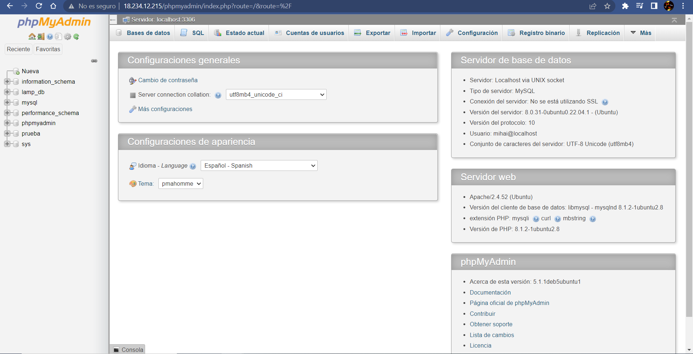
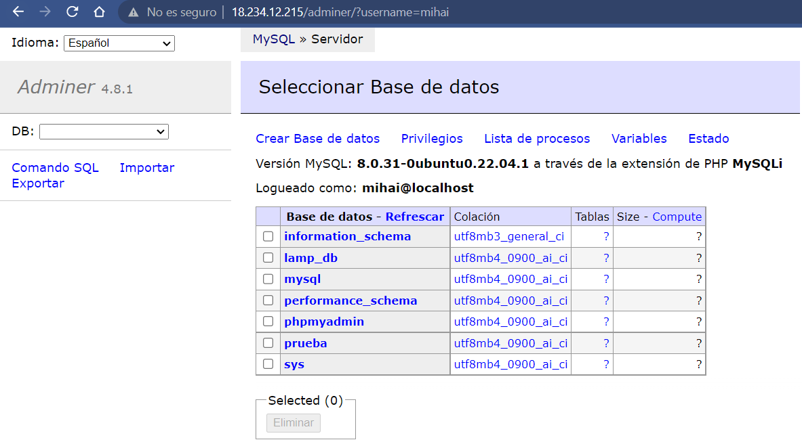

# IAW-Practica-02
Práctica 2 de instalación de herramientas LAMP en __RedHatEnterpriseLinux (RHEL)__

## Implementando la nueva Instancia
Lo primero que haremos será entrar en dentro del panel EC2 en AWS Academy para poder lanzar la nueva instancia.

La configuración de la instancia será la siguiente:


__1:__ Ponemos el nombre a la máquina y seleccionamos como SO el RedHat


__2:__ Seleccionamos el par de claves que hemos usado anteriormente *vockey*, aunque se podría crear otro par de claves si queremos.


__3:__ Antes de acabar con la configuración de la instancia tendremos que ponerle una capacidad de RAM de 4GB para que la máquina vaya de forma más fluida.


__4:__ Como último paso para acabar con la configuración de la instancia, haremos que la instancia que hemos creado tenga una IP Elástica, aunque este paso no es estrictamente necesario.


## Implementación de la Instancia en Visual Studio Code

Previamente a la implementación de la instancia tendremos que instalar en el Visual Studio la extensión del *Explorador Remoto* de __Microsoft__


__1:__ Una vez instalada la extensión añadiremos el acceso a la máquina dentro de la configuración de los destinos SSH.


__2:__ Hecho esto ya podremos conectarnos a la máquina de RHEL remotamente desde el Visual Studio. Ahora clonaremos el repositorio que hemos creado en __GitHub__ para poder empezar a trabajar. Para clonar el repositorio tendremos que copiar el enlace del repositorio y ejecutar el siguiente comando:

```bash
git clone https://github.com/Mihai95102/IAW-Practica-02.git
```

## Empezando a automatizar los scripts

Para empezar a trabajar, primero crearemos esta estrctura dentro del directorio:


Empezamos a crear el script de automatización para la instalación de las herramientas LAMP, además de phpMyAdmin y Adminer.

El script *LAMP_tools.sh* contendrá lo siguiente:

```bash
#!/bin/bash

set -x

# Variables de configuración
DB_USER=mihai
DB_PASSWORD=hola

# Actualizamos los repositorios
dnf update -y

# Actualizamos los paquetes nuevos
# dnf upgrade -y

# Instalamos el servidor web apache
dnf install httpd -y

    # Iniciamos el servicio de Apache
    systemctl start httpd

    # Habilitamos el servicio de Apache
    systemctl enable httpd

# Instalamos el sistema gestor de BD
dnf install mysql-server -y

    # Iniciamos el servicio de MySQL
    systemctl start mysqld

    # Habilitamos el servicio de MySQL
    systemctl enable mysqld

# Instalamos PHP
dnf install php -y
    
    # Instalamos las extensiones de PHP
    dnf install php-mysqlnd -y

    dnf install php-zip php-json php-fpm -y

    # Habilitamos el servicio de FPM
    systemctl enable --now php-fpm

    # Después de la instalación es necesario reiniciar el servicio de Apache
    systemctl restart httpd

# Copiamos el archivo para ver que se ha instalado
cp ../php/info.php /var/www/html

# Instalamos los repositorios necesarios para la instalación de phpMyAdmin
dnf install -y wget php php-pdo php-pecl-zip php-common php-mbstring php-cli php-xml tar
dnf install -y php-mbstring

# Instalación de phpMyAdmin

    # Creación de la base de datos y el usuario de BD
    mysql -u root <<< "DROP USER IF EXISTS $DB_USER"
    mysql -u root <<< "CREATE USER IF NOT EXISTS '$DB_USER'@'%' IDENTIFIED BY '$DB_PASSWORD'"
    mysql -u root <<< "GRANT ALL PRIVILEGES ON *.* TO $DB_USER@'%'"

    # Accedemos al directorio /var/www/html
    cd /var/www/html

    # Instalamos la utilidad wget para poder descargar el código fuente de phpMyAdmin
    dnf install wget

    # Descargamos el código fuente de phpMyAdmin
    wget https://www.phpmyadmin.net/downloads/phpMyAdmin-latest-all-languages.tar.gz

    # Descomprimimos el archivo que acabamos de descargar
    tar xvf phpMyAdmin-latest-all-languages.tar.gz

    # Eliminamos el archivo .tar.gz
    rm phpMyAdmin-latest-all-languages.tar.gz

    # Renombramos el directorio
    mv phpMyAdmin-5.2.0-all-languages/ phpmyadmin

    # Modificamos el propietario y el grupo del directorio
    chown -R apache:apache /var/www/html/phpmyadmin

    # Creamos el archivo de configuración a partir del archivo config.sample.inc.php
    cp /var/www/html/phpmyadmin/config.sample.inc.php /var/www/html/phpmyadmin/config.inc.php

    # Editamos el archivo de configuración config.inc.php
    # nano /var/www/html/phpmyadmin/config.inc.php

# Instalación de Adminer:

    # Descargamos el archivo de Adminer
    wget https://github.com/vrana/adminer/releases/download/v4.8.1/adminer-4.8.1-mysql.php

    # Creamos un directorio para Adminer
    mkdir -p /var/www/html/adminer

    # Renombramos el archivo
    mv adminer-4.8.1-mysql.php /var/www/html/adminer/index.php

    # Modificamos el propietario y el grupo del directorio /var/www/html
    chown -R apache:apache /var/www/html -R

    # Reiniciamos Apache
    systemctl restart httpd
```
__1:__ Para comprobar que el servidor de PHPMyAdmin funciona tendremos que acceder a él con la IP de la máquina, *"18.234.12.215/phpmyadmin"*.


Una vez accedemos con nuestro usuario y contraseña podemos ver que tenemos acceso a todas las bases de datos del sistema.



__2:__ A continuación comprobaremos que podemos acceder al servidor de Adminer con el mismo usuario y contraseña que hemos usado para PHPMyAdmin. Para acceder al servidor de Adminner escribiremos en el navegador *"18.234.12.215/adminer"*.


Una vez accedemos con nuestro usuario y contraseña podemos ver que tenemos acceso a todas las bases de datos del sistema.



Aqui termina la guía de la instalación de las herramientas LAMP.